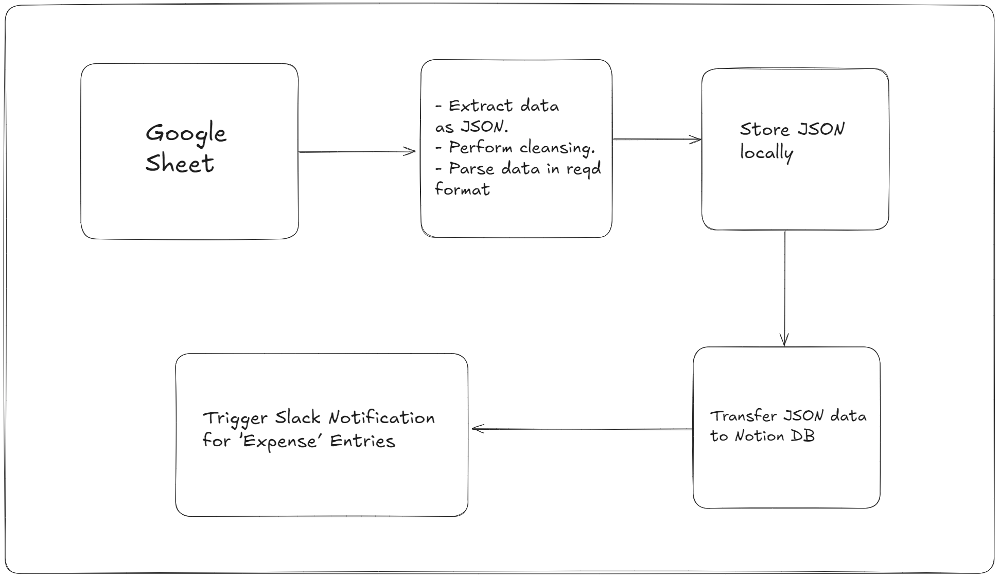

# Notion Expense Tracker Automation

## Overview ℹ️
This project simplifies expense tracking by automating everything from pulling data to organizing and sharing it. It works by extracting data from JSON files, storing it in a Google Sheet, and syncing it with a Notion database. Plus, it even integrates with Slack, making sure the expense info is always up-to-date and easy to access.

## Workflow 💪
Here is the workflow diagram

## Usage 🚀
- Update the `.env` file using the `.env.template`.
- Populate your google sheet with your expense data. (Use this template - **googleSheetTemplate.xlsx**)
- Then simply run `npm start`.
- Sit back and relax and let the expenses be added to your Notion DB! 😎